# 🎓 Event Management System - GUC

> **Enterprise-grade event management platform for the German University in Cairo (GUC)**  
> Built with modern technologies, clean architecture principles, and a focus on scalability and maintainability.

---

## 📋 Table of Contents

- [Project Title](#project-title)
- [Motivation](#motivation)
- [Build Status](#build-status)
- [Code Style](#code-style)
- [Screenshots](#screenshots)
- [Tech Stack / Frameworks Used](#tech-stack--frameworks-used)
- [Features](#features)
- [Code Examples](#code-examples)
- [Installation](#installation)
- [API References](#api-references)
- [Tests](#tests)
- [How to Contribute](#how-to-contribute)
- [Credits](#credits)
- [License](#license)

---

## 🎯 Project Title

**Event Management System for German University in Cairo (GUC)**

A comprehensive full-stack application designed to streamline event organization, registration, and management for students, staff, professors, vendors, and administrators at GUC. The system supports multiple event types including workshops, trips, bazaars, conferences, and gym sessions with integrated payment processing, vendor participation, loyalty programs, and automated certificate generation.

---

## 💡 Motivation

The German University in Cairo needed a modern, centralized platform to manage various campus events efficiently. Traditional methods involved manual registration, paper-based tracking, and fragmented communication channels. This project aims to:

1. **Centralize Event Management** - Provide a single platform for all event types (workshops, trips, bazaars, conferences, gym sessions)
2. **Streamline Registration** - Enable easy online registration with integrated payment processing via Stripe
3. **Enhance User Experience** - Offer a modern, responsive UI with dark mode, real-time notifications, and intuitive navigation
4. **Improve Vendor Participation** - Allow vendors to apply for bazaars, manage booths, and interact with event organizers
5. **Automate Administrative Tasks** - Generate certificates, QR codes, and reports automatically
6. **Ensure Security & Scalability** - Implement role-based access control, JWT authentication, and a scalable MERN architecture
7. **Foster Engagement** - Implement a loyalty program to reward active participants with points and badges

This system reduces administrative overhead, improves communication, and provides data-driven insights through comprehensive analytics and reporting.

---

## 🚦 Build Status

### Current Status: **Active Development** (Sprint 2 Completed)

#### ✅ Working Features
- ✅ **Authentication & Authorization** - JWT-based auth with role-based access control (Student, Staff, TA, Professor, Vendor, Admin)
- ✅ **Email Verification** - Automated email verification with Nodemailer
- ✅ **Event Management** - Full CRUD operations for all event types
- ✅ **Registration System** - Event registration with capacity management and waitlists
- ✅ **Payment Processing** - Stripe integration with wallet system and refunds
- ✅ **Vendor Applications** - Vendors can apply for bazaars with tax card verification
- ✅ **Rating & Feedback** - Users can rate events and leave comments
- ✅ **Loyalty Program** - Points-based system with badges and rewards
- ✅ **Certificate Generation** - Automated PDF certificates for event attendees
- ✅ **QR Code System** - QR codes for event check-in and vendor badges
- ✅ **Notifications** - Real-time in-app notifications
- ✅ **Platform Map** - Interactive map for managing event locations and vendor booths
- ✅ **Reports & Analytics** - Excel/PDF export for events and registrations

#### ⚠️ Known Issues & Limitations
1. **Tax Card Validation** - Currently accepts optional tax card images; needs to be mandatory in production (see `shared/src/index.ts:348`)
2. **Bulk Export** - Multiple event registration exports not yet implemented on backend (see `event-manager/src/features/events/pages/BackOfficeEventsPage.tsx:618`)
3. **Email Rate Limiting** - Verification email cooldown is 5 minutes; may need adjustment based on usage patterns
4. **Image Uploads** - Currently using base64 encoding; should migrate to cloud storage (AWS S3/Cloudinary) for better performance
5. **Real-time Updates** - Notifications are fetched on interval; WebSocket implementation pending for true real-time updates
6. **Search Performance** - Large event datasets (>1000 events) may experience slower search; needs indexing optimization
7. **Mobile Responsiveness** - Some admin dashboard components need better mobile optimization
8. **Cancellation Policy** - 2-week cancellation policy is hard-coded; should be configurable per event type
9. **Test Coverage** - Unit test coverage is ~60%; aiming for 80%+ in next sprint
10. **Documentation** - API documentation needs improvement with OpenAPI/Swagger integration

#### 🔄 Planned Improvements (Sprint 3)
- Add WebSocket support for real-time notifications
- Implement comprehensive Jest unit tests (target: 80% coverage)
- Optimize database queries with proper indexing
- Add Redis caching layer for frequently accessed data
- Implement file upload service with cloud storage
- Add multi-language support (English/Arabic)

---

## 📝 Code Style

This project follows industry-standard coding conventions to ensure readability, maintainability, and consistency across the codebase.

### TypeScript/JavaScript Standards
- **Style Guide**: ESLint + TypeScript ESLint (strict mode enabled)
- **Naming Conventions**:
  - **Variables & Functions**: `camelCase` (e.g., `getUserById`, `eventService`)
  - **Classes & Interfaces**: `PascalCase` (e.g., `UserService`, `IEvent`)
  - **Constants**: `UPPER_SNAKE_CASE` (e.g., `MAX_FILE_SIZE`, `JWT_SECRET`)
  - **Files**: `kebab-case` for files (e.g., `user.service.ts`, `event.router.ts`)
  - **React Components**: `PascalCase` (e.g., `EventCard.tsx`, `LoginPage.tsx`)
  - **Private Methods**: Prefix with `_` (e.g., `_validateInput`)
  - **Protected Methods**: Use TypeScript `protected` keyword

### Code Organization
- **Backend Structure**: 
  - Models (`/models`) - Mongoose schemas
  - Services (`/services`) - Business logic layer
  - Routers (`/routers`) - tRPC API endpoints
  - Repositories (`/repositories`) - Data access layer
  - Utils (`/utils`) - Helper functions

- **Frontend Structure**:
  - Features (`/features`) - Feature-based modules
  - Components (`/components`) - Reusable UI components
  - Hooks (`/hooks`) - Custom React hooks
  - Store (`/store`) - Zustand state management

### Design Patterns
- **Service Layer Pattern** - Business logic encapsulation
- **Repository Pattern** - Data access abstraction
- **Factory Pattern** - Object creation (User, Event factories)
- **Middleware Pattern** - tRPC middleware for auth, logging, error handling
- **Observer Pattern** - Event-driven notifications

### Documentation Standards
- **JSDoc Comments** - All public functions, classes, and interfaces
- **Inline Comments** - Complex logic explanation
- **Type Safety** - Full TypeScript strict mode (`noImplicitAny`, `strictNullChecks`)
- **Error Handling** - Consistent TRPCError usage with descriptive messages

### Formatting
- **Indentation**: 2 spaces (no tabs)
- **Line Length**: Max 100 characters
- **Quotes**: Single quotes for strings (except JSX - double quotes)
- **Semicolons**: Required
- **Trailing Commas**: Yes (improves git diffs)

### Linting & Formatting Tools
- **ESLint** - Code linting with TypeScript support
- **Prettier** - Code formatting (not currently configured, but recommended)
- **TypeScript Compiler** - Strict type checking

---

## 📸 Screenshots

### 1. Landing Page & Authentication

*Landing page with modern design and entry options*

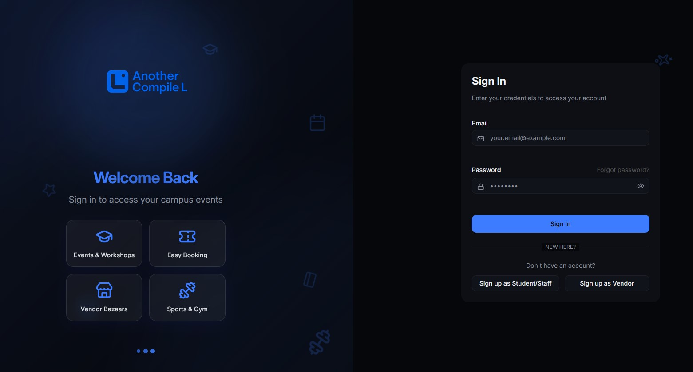
*Secure login with JWT authentication*


*Student/Staff/Professor/TA registration with GUC ID validation*

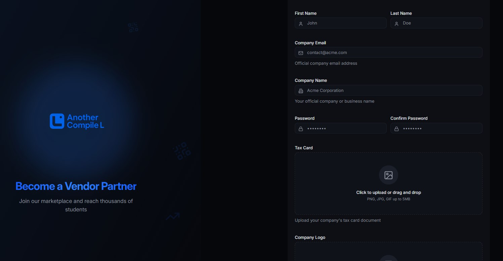
*Vendor registration with company details and tax card upload*

### 2. Dashboard & Events
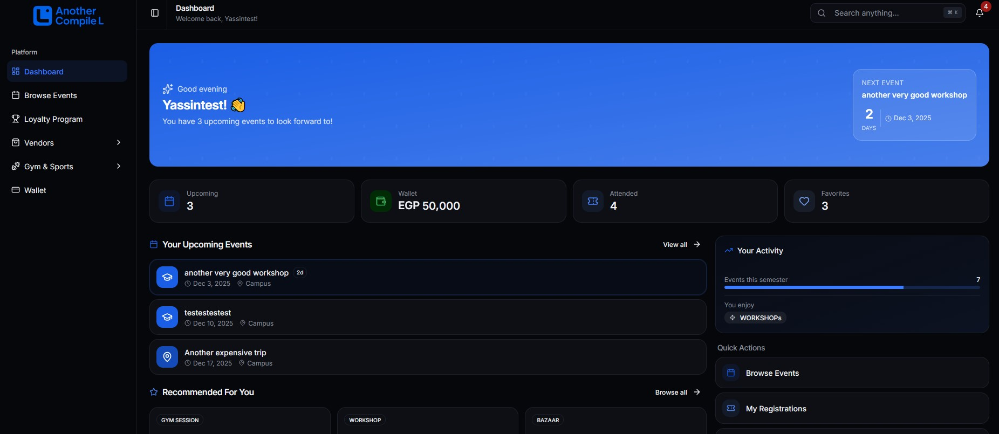
*Comprehensive dashboard with analytics and quick actions*

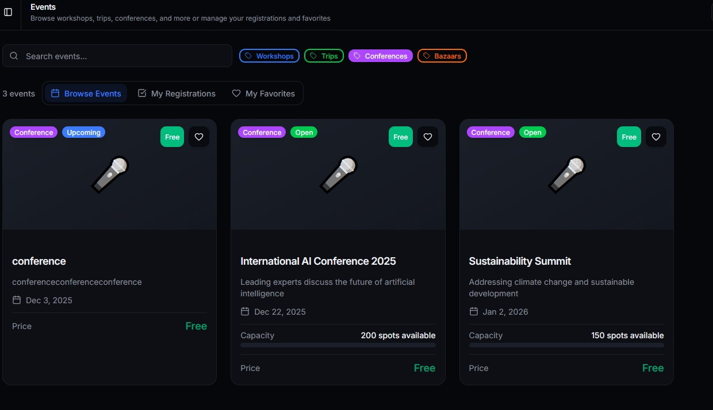
*Browse and filter events by type, location, and date*

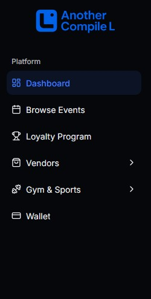
*Navigation menu with role-based access control*

### 3. Event Management
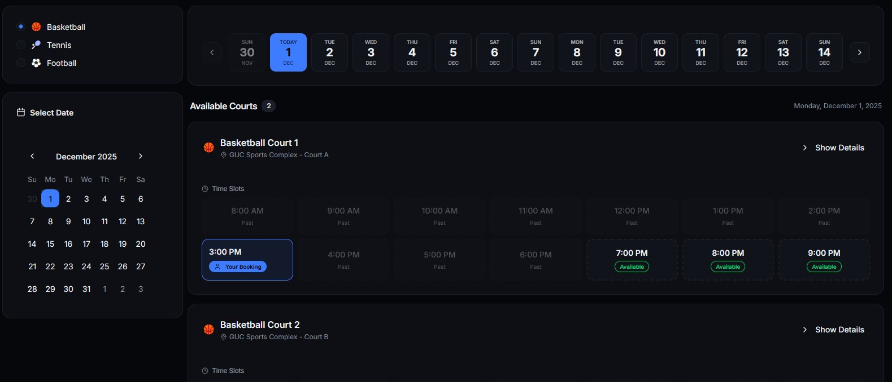
*Gym session management with court booking system*

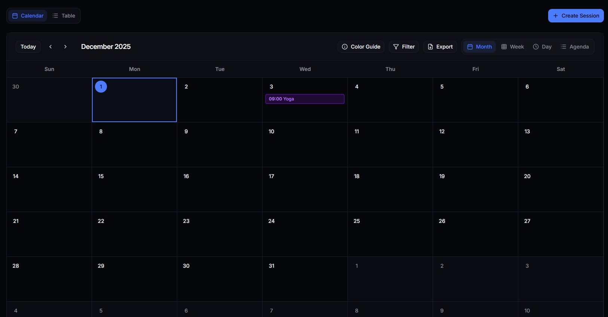
*Interactive calendar for scheduling gym sessions*

### 4. Loyalty & Wallet
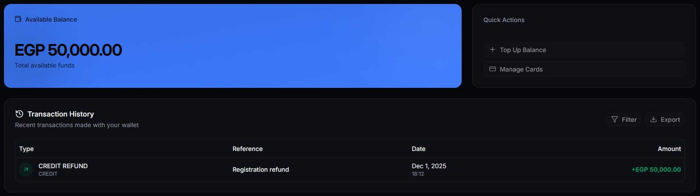
*Digital wallet for payments, refunds, and loyalty points*

### 5. Admin & Analytics
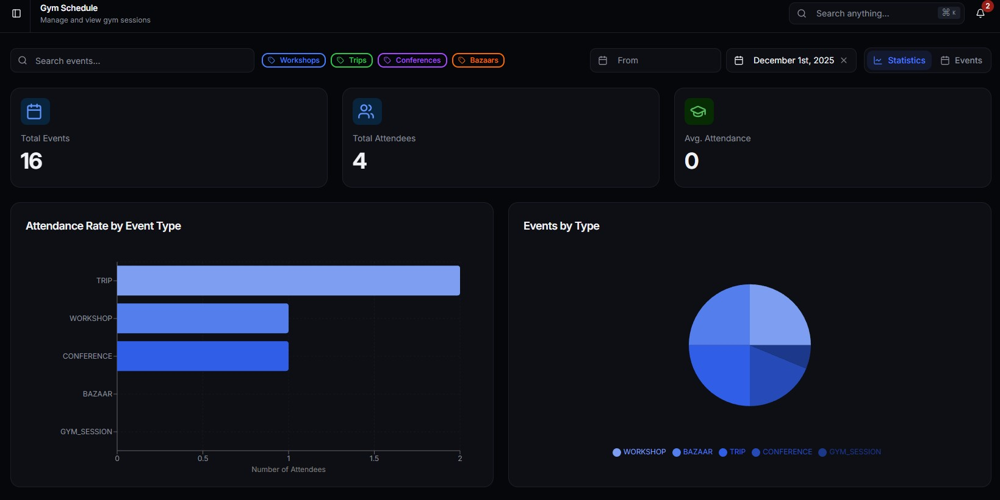
*Comprehensive analytics dashboard with charts and reports*

---

## 🚀 Tech Stack / Frameworks Used

### Core Stack: **MERN + TypeScript**
- **M** - MongoDB 6.0+ (NoSQL Database)
- **E** - Express 5.1.0 (Backend Framework)
- **R** - React 19.1.1 (Frontend Library)
- **N** - Node.js 18+ (Runtime Environment)
- **TypeScript 5.5+** (Type Safety across entire stack)

### Frontend Technologies
| Technology | Version | Purpose |
|------------|---------|---------|
| **React** | 19.1.1 | UI library with latest concurrent features |
| **Vite** | 7.1.14 | Lightning-fast build tool and dev server |
| **TypeScript** | 5.9.3 | Static typing and enhanced IDE support |
| **TailwindCSS** | 4.1.14 | Utility-first CSS framework |
| **shadcn/ui** | Latest | High-quality accessible component library |
| **Radix UI** | Latest | Unstyled accessible component primitives |
| **Zustand** | 5.0.2 | Lightweight state management |
| **TanStack Query** | 5.56.2 | Server state management & caching |
| **tRPC Client** | 11.0.0 | End-to-end typesafe API client |
| **React Router** | 7.9.4 | Client-side routing |
| **Framer Motion** | 11.11.17 | Animation library |
| **React Hook Form** | 7.63.0 | Form management with validation |
| **Zod** | 3.25.76 | Schema validation |
| **Lucide React** | 0.544.0 | Icon library |
| **Recharts** | 2.15.4 | Chart library for analytics |
| **date-fns** | 4.1.0 | Date manipulation |
| **React Hot Toast** | 2.6.0 | Toast notifications |
| **Stripe.js** | 8.3.0 | Payment processing frontend |
| **jsPDF** | 3.0.3 | PDF generation |
| **XLSX** | 0.18.5 | Excel file generation |

### Backend Technologies
| Technology | Version | Purpose |
|------------|---------|---------|
| **Node.js** | 18+ | JavaScript runtime |
| **Express** | 5.1.0 | Web application framework |
| **TypeScript** | 5.5.4 | Type safety on backend |
| **tRPC Server** | 11.5.1 | End-to-end typesafe API |
| **MongoDB** | 6.0+ | NoSQL database |
| **Mongoose** | 8.18.3 | MongoDB object modeling |
| **Zod** | 3.25.76 | Runtime type validation |
| **JWT** | 9.0.2 | Authentication tokens |
| **bcrypt** | 6.0.0 | Password hashing |
| **Stripe** | 16.12.0 | Payment processing backend |
| **Nodemailer** | 6.9.15 | Email service |
| **PDFKit** | 0.17.2 | PDF certificate generation |
| **QRCode** | 1.5.4 | QR code generation |
| **Sharp** | 0.34.4 | Image processing |
| **ExcelJS** | 4.4.0 | Excel report generation |
| **Luxon** | 3.7.2 | Date/time manipulation |
| **UUID** | 10.0.0 | Unique identifier generation |
| **dotenv** | 16.4.5 | Environment variable management |
| **CORS** | 2.8.5 | Cross-origin resource sharing |

### Development Tools
| Tool | Purpose |
|------|---------|
| **Jest** | Unit testing framework |
| **Supertest** | HTTP assertion library |
| **ESLint** | Code linting |
| **tsx** | TypeScript execution for development |
| **Postman** | API testing and documentation |
| **VS Code Tasks** | Automated build and run tasks |

### Shared Package
- **@event-manager/shared** - Shared TypeScript types and Zod schemas between frontend and backend

### Architecture Highlights
- **Monorepo Structure** - Three packages: `backend`, `event-manager` (frontend), `shared`
- **Type Safety** - End-to-end type safety with tRPC
- **Clean Architecture** - Repository pattern, service layer, separation of concerns
- **API Design** - RESTful principles via tRPC procedures
- **Real-time Features** - Polling-based notifications (WebSocket planned)
- **Security** - JWT authentication, bcrypt hashing, role-based access control
- **Scalability** - Modular design, stateless API, ready for horizontal scaling

---

## ✨ Features

### 🔐 Authentication & User Management
- Multi-role registration (Student, Staff, TA, Professor, Vendor, Admin)
- Email verification with automated emails
- JWT-based authentication with refresh tokens
- Password reset via email
- Role-based access control (RBAC)
- User profile management with avatar upload
- Admin user management (create/delete admin accounts, block/unblock users)

### 📅 Event Management
- **Event Types**: Workshops, Trips, Bazaars, Conferences, Gym Sessions
- Full CRUD operations for events
- Advanced filtering (type, location, date range, price)
- Event search functionality
- Capacity management with waitlists
- Event status tracking (Draft, Published, Cancelled, Completed)
- Whitelist system for exclusive events
- Event duplication for recurring events
- Event image uploads and management

### 🎟️ Registration System
- Online event registration with real-time capacity checking
- Registration status tracking (Pending, Confirmed, Waitlisted, Cancelled)
- 2-week cancellation policy with automatic refunds
- Waitlist management with automatic promotion
- Registration history for users
- QR code generation for event check-in
- Attendance tracking

### 💳 Payment Processing
- **Stripe Integration** - Secure payment processing
- Digital wallet system for users
- Wallet top-up functionality
- Payment history and transaction tracking
- Automated refunds to wallet on cancellation
- Support for free and paid events
- Payment receipts via email

### 🏪 Vendor Management
- Vendor application system for bazaars
- Tax card and logo upload for verification
- Application status tracking (Pending, Approved, Rejected)
- Booth/space allocation on platform map
- Vendor visitor QR badge generation
- Vendor-specific event participation
- Vendor poll system for vote-based selections

### ⭐ Rating & Feedback System
- Event rating system (1-5 stars)
- Comment system with moderation
- Rating statistics and aggregation
- Comment deletion by moderators
- Feedback reports for event organizers

### 🏆 Loyalty Program
- Points-based reward system
- Automatic point allocation for event participation
- Badge system for achievements
- Loyalty tier system
- Points history tracking
- Redemption system (planned)

### 📜 Certificate Generation
- Automated PDF certificate generation
- Customizable certificate templates
- Batch certificate generation for events
- Email delivery of certificates
- Certificate status tracking
- QR code on certificates for verification

### 🔔 Notification System
- In-app notifications
- Email notifications for important events
- Notification preferences management
- Real-time notification updates (polling-based)
- Notification history

### 🗺️ Platform Map
- Interactive map for event locations
- Booth/space management for bazaars
- Drag-and-drop booth placement
- Visual representation of venue layout

### 📊 Reports & Analytics
- Event statistics dashboard
- Registration reports (Excel/PDF export)
- Revenue tracking
- User engagement metrics
- Vendor participation analytics
- Customizable date range filters

### 🎓 Gym-Specific Features
- Court booking system
- Sport type management
- Recurring session scheduling
- Calendar view for gym sessions
- Equipment tracking

---

## 💻 Code Examples

### Example 1: User Authentication Service
```typescript
/**
 * Academic user signup with email verification
 * Location: backend/src/services/user.service.ts
 */
async signupAcademic(data: {
  email: string;
  password: string;
  firstName: string;
  lastName: string;
  studentId: string;
  role: UserRole;
}) {
  // Validate email domain (must be @student.guc.edu.eg or @guc.edu.eg)
  if (data.role === 'Student' && !data.email.endsWith('@student.guc.edu.eg')) {
    throw new TRPCError({
      code: 'BAD_REQUEST',
      message: 'Students must use @student.guc.edu.eg email',
    });
  }

  // Check if email already exists
  const existingUser = await userRepository.findByEmail(data.email);
  if (existingUser) {
    throw new TRPCError({
      code: 'CONFLICT',
      message: 'An account with this email already exists',
    });
  }

  // Hash password with bcrypt
  const hashedPassword = await hashPassword(data.password);

  // Create verification token
  const verificationToken = crypto.randomBytes(32).toString('hex');
  const tokenExpiry = new Date(Date.now() + 24 * 60 * 60 * 1000); // 24 hours

  // Create user
  const user = await userRepository.create({
    ...data,
    password: hashedPassword,
    emailVerificationToken: verificationToken,
    emailVerificationExpires: tokenExpiry,
    isEmailVerified: false,
  });

  // Send verification email
  await mailService.sendVerificationEmail(user.email, verificationToken);

  return {
    message: 'Account created successfully. Please check your email to verify your account.',
  };
}
```

### Example 2: Event Registration with Capacity Management
```typescript
/**
 * Register user for an event with capacity checking and waitlist
 * Location: backend/src/services/registration.service.ts
 */
async registerForEvent(userId: string, eventId: string) {
  // Check if event exists
  const event = await eventService.getEventById(eventId);
  if (!event) {
    throw new TRPCError({ code: 'NOT_FOUND', message: 'Event not found' });
  }

  // Check if event is published
  if (event.status !== 'PUBLISHED') {
    throw new TRPCError({
      code: 'BAD_REQUEST',
      message: 'Cannot register for unpublished event',
    });
  }

  // Check if user is already registered
  const existingReg = await registrationRepository.findByUserAndEvent(userId, eventId);
  if (existingReg) {
    throw new TRPCError({
      code: 'CONFLICT',
      message: 'You are already registered for this event',
    });
  }

  // Check event capacity
  const registrationCount = await registrationRepository.countByEvent(eventId);
  const isAtCapacity = registrationCount >= event.capacity;

  // Create registration
  const registration = await registrationRepository.create({
    user: userId,
    event: eventId,
    status: isAtCapacity ? 'WAITLISTED' : 'PENDING',
    registeredAt: new Date(),
  });

  // Send notification
  const notificationMessage = isAtCapacity
    ? 'You have been added to the waitlist'
    : 'Registration successful! Please complete payment.';
  
  await notificationService.create(userId, notificationMessage, {
    type: 'REGISTRATION',
    eventId,
  });

  return registration;
}
```

### Example 3: Payment Processing with Stripe
```typescript
/**
 * Process payment via Stripe for event registration
 * Location: backend/src/services/payment.service.ts
 */
async createPaymentIntent(userId: string, registrationId: string) {
  // Get registration details
  const registration = await registrationRepository.findByIdPopulated(registrationId);
  if (!registration) {
    throw new TRPCError({ code: 'NOT_FOUND', message: 'Registration not found' });
  }

  // Verify ownership
  if (registration.user.toString() !== userId) {
    throw new TRPCError({ code: 'FORBIDDEN', message: 'Unauthorized' });
  }

  const event = registration.event as IEvent;
  const amountInCents = Math.round(event.price * 100); // Convert to cents

  // Create Stripe payment intent
  const paymentIntent = await stripe.paymentIntents.create({
    amount: amountInCents,
    currency: 'usd',
    metadata: {
      userId,
      registrationId: registrationId.toString(),
      eventId: event._id.toString(),
      eventName: event.name,
    },
  });

  // Save payment record
  await paymentRepository.create({
    user: userId,
    registration: registrationId,
    amount: event.price,
    currency: 'USD',
    stripePaymentIntentId: paymentIntent.id,
    status: 'PENDING',
  });

  return {
    clientSecret: paymentIntent.client_secret,
  };
}
```

### Example 4: Loyalty Points Calculation
```typescript
/**
 * Award loyalty points for event attendance
 * Location: backend/src/services/loyalty.service.ts
 */
async awardPointsForAttendance(userId: string, eventId: string) {
  const event = await eventRepository.findById(eventId);
  if (!event) {
    throw new TRPCError({ code: 'NOT_FOUND', message: 'Event not found' });
  }

  // Calculate points based on event type and price
  let points = 10; // Base points
  
  // Event type multiplier
  const typeMultipliers = {
    'Workshop': 2,
    'Conference': 3,
    'Trip': 2.5,
    'Bazaar': 1,
    'Gym': 1,
  };
  
  points *= (typeMultipliers[event.type] || 1);
  
  // Price tier bonus
  if (event.price > 100) points += 20;
  else if (event.price > 50) points += 10;
  
  // Update user loyalty points
  const user = await userRepository.findById(userId);
  if (!user) throw new TRPCError({ code: 'NOT_FOUND' });
  
  const newPoints = (user.loyaltyPoints || 0) + Math.floor(points);
  await userRepository.update(userId, { loyaltyPoints: newPoints });
  
  // Check for badge achievements
  await this.checkAndAwardBadges(userId, newPoints);
  
  return { pointsAwarded: Math.floor(points), totalPoints: newPoints };
}
```

### Example 5: tRPC Router with Role-Based Access Control
```typescript
/**
 * Event management router with authentication middleware
 * Location: backend/src/routers/events.router.ts
 */
export const eventsRouter = router({
  // Public route - anyone can view events
  getEvents: publicProcedure
    .input(EventFilterSchema)
    .query(async ({ input, ctx }) => {
      const userId = ctx.user?._id ? String(ctx.user._id) : undefined;
      return eventService.getEvents({
        page: input.page,
        limit: input.limit,
        search: input.search,
        type: input.type,
        userId,
      });
    }),

  // Protected route - only authenticated users
  registerForEvent: protectedProcedure
    .input(z.object({ eventId: z.string() }))
    .mutation(async ({ input, ctx }) => {
      return registrationService.registerForEvent(
        String(ctx.user._id),
        input.eventId
      );
    }),

  // Admin-only route - only admins can create events
  createEvent: adminProcedure
    .input(CreateEventSchema)
    .mutation(async ({ input, ctx }) => {
      return eventService.create({
        ...input,
        createdBy: String(ctx.user._id),
      });
    }),

  // Role-specific route - professors can manage their workshops
  updateWorkshop: protectedProcedure
    .input(UpdateWorkshopSchema)
    .mutation(async ({ input, ctx }) => {
      // Check if user is professor or admin
      if (ctx.user.role !== 'Professor' && ctx.user.role !== 'Admin') {
        throw new TRPCError({
          code: 'FORBIDDEN',
          message: 'Only professors and admins can update workshops',
        });
      }
      return eventService.updateWorkshop(input.id, input);
    }),
});
```

---

## 🛠️ Installation

### Prerequisites
Before you begin, ensure you have the following installed:
- **Node.js** >= 18.0.0 ([Download](https://nodejs.org/))
- **MongoDB** >= 6.0 ([Download](https://www.mongodb.com/try/download/community))
- **npm** >= 9.0.0 (comes with Node.js) or **yarn** >= 1.22.0
- **Git** ([Download](https://git-scm.com/downloads))
- **Stripe Account** (for payment processing) - [Sign up](https://stripe.com/)
- **Mailgun Account** (for emails) or SMTP server

### Step 1: Clone the Repository
```bash
git clone https://github.com/Advanced-Computer-Lab-2025/Another-Compile-L.git
cd Another-Compile-L
```

### Step 2: Install Shared Package Dependencies
```bash
cd shared
npm install
npm run build
cd ..
```

### Step 3: Install Backend Dependencies
```bash
cd backend
npm install
```

### Step 4: Configure Backend Environment
Create a `.env` file in the `backend/` directory:
```bash
# Copy from example
cp .env.example .env
```

Edit `.env` with your configuration:
```env
# Server Configuration
PORT=5000
NODE_ENV=development
FRONTEND_URL=http://localhost:5173

# Database
MONGODB_URI=mongodb://localhost:27017/event-manager

# JWT
JWT_SECRET=your-super-secret-jwt-key-change-this-in-production
JWT_REFRESH_SECRET=your-refresh-secret-key
JWT_EXPIRES_IN=15m
JWT_REFRESH_EXPIRES_IN=7d

# Email Configuration (Mailgun or SMTP)
MAIL_HOST=smtp.mailgun.org
MAIL_PORT=587
MAIL_USER=your-mailgun-smtp-username
MAIL_PASSWORD=your-mailgun-smtp-password
MAIL_FROM=noreply@yourdomain.com

# Stripe
STRIPE_SECRET_KEY=sk_test_your_stripe_secret_key
STRIPE_PUBLISHABLE_KEY=pk_test_your_stripe_publishable_key
STRIPE_WEBHOOK_SECRET=whsec_your_webhook_secret

# File Upload
MAX_FILE_SIZE=5242880  # 5MB in bytes
```

### Step 5: Install Frontend Dependencies
```bash
cd ../event-manager
npm install
```

### Step 6: Configure Frontend Environment
Create a `.env` file in the `event-manager/` directory:
```bash
cp .env.example .env
```

Edit `.env`:
```env
VITE_API_URL=http://localhost:5000
VITE_STRIPE_PUBLISHABLE_KEY=pk_test_your_stripe_publishable_key
```

### Step 7: Start MongoDB
```bash
# On Windows (if installed as service)
net start MongoDB

# On macOS/Linux
mongod

# Or use MongoDB Compass for GUI
```

### Step 8: Seed Database (Optional)
```bash
cd backend
npm run seed:comprehensive
```

### Step 9: Start the Application

#### Option A: Using VS Code Tasks (Recommended)
1. Open the project in VS Code
2. Press `Ctrl+Shift+P` (or `Cmd+Shift+P` on Mac)
3. Type "Tasks: Run Task"
4. Select "Start Full Stack"

This will:
- Build the shared package
- Start the backend on http://localhost:5000
- Start the frontend on http://localhost:5173

#### Option B: Manual Start
```bash
# Terminal 1 - Backend
cd backend
npm run dev

# Terminal 2 - Frontend
cd event-manager
npm run dev
```

### Step 10: Access the Application
- **Frontend**: http://localhost:5173
- **Backend API**: http://localhost:5000
- **MongoDB**: mongodb://localhost:27017

### Default Test Accounts (if seeded)
```
Admin:
Email: admin@guc.edu.eg
Password: Admin123!

Student:
Email: john.doe@student.guc.edu.eg
Password: Password123!

Professor:
Email: professor@guc.edu.eg
Password: Password123!

Vendor:
Email: vendor@vendor.com
Password: Password123!
```

### Troubleshooting
- **Port already in use**: Change `PORT` in backend `.env` and `VITE_API_URL` in frontend `.env`
- **MongoDB connection error**: Ensure MongoDB is running and `MONGODB_URI` is correct
- **Stripe errors**: Verify API keys are correct and in test mode
- **Email errors**: Check SMTP credentials or use Mailgun

---

## 📚 API References

The backend uses **tRPC** for type-safe API calls. Below are key API routes:

### Authentication Routes (`auth.*`)

#### 1. **POST** `auth.signupAcademic`
Register a new academic user (Student/Staff/TA/Professor)
```typescript
// Input
{
  email: string;           // Must end with @guc.edu.eg or @student.guc.edu.eg
  password: string;        // Min 8 characters
  firstName: string;
  lastName: string;
  gucId: string;          // Student/Staff ID
  role: 'Student' | 'Staff' | 'TA' | 'Professor';
}

// Response
{
  message: string;        // Success message
}
```

#### 2. **POST** `auth.login`
Authenticate user and receive JWT tokens
```typescript
// Input
{
  email: string;
  password: string;
}

// Response
{
  accessToken: string;     // JWT access token (15min expiry)
  refreshToken: string;    // JWT refresh token (7 days expiry)
  user: {
    id: string;
    email: string;
    firstName: string;
    lastName: string;
    role: string;
    isEmailVerified: boolean;
    avatar?: string;
  }
}
```

#### 3. **POST** `auth.verifyEmail`
Verify email address with token from email
```typescript
// Input
{
  token: string;           // Verification token from email
}

// Response
{
  message: string;
}
```

#### 4. **POST** `auth.requestPasswordReset`
Request password reset email
```typescript
// Input
{
  email: string;
}

// Response
{
  message: string;
}
```

#### 5. **GET** `auth.me`
Get current authenticated user profile (requires auth)
```typescript
// Headers
Authorization: Bearer <access_token>

// Response
{
  id: string;
  email: string;
  firstName: string;
  lastName: string;
  role: string;
  isEmailVerified: boolean;
  avatar?: string;
  loyaltyPoints: number;
  wallet: {
    balance: number;
    currency: string;
  };
}
```

### Event Routes (`events.*`)

#### 6. **GET** `events.getEvents`
Get all events with filtering and pagination (public)
```typescript
// Input (query parameters)
{
  page?: number;           // Default: 1
  limit?: number;          // Default: 10
  search?: string;         // Search in name/description
  type?: string;           // 'Workshop' | 'Trip' | 'Bazaar' | 'Conference' | 'Gym'
  location?: string;       // Filter by location
  startDate?: string;      // ISO date string
  endDate?: string;        // ISO date string
  maxPrice?: number;       // Maximum price filter
}

// Response
{
  events: Array<{
    id: string;
    name: string;
    description: string;
    type: string;
    location: string;
    startDate: string;
    endDate: string;
    price: number;
    capacity: number;
    registeredCount: number;
    imageUrl?: string;
    status: 'DRAFT' | 'PUBLISHED' | 'CANCELLED' | 'COMPLETED';
  }>;
  total: number;
  page: number;
  totalPages: number;
}
```

#### 7. **GET** `events.getEventById`
Get single event details (public)
```typescript
// Input
{
  id: string;              // Event ID
}

// Response
{
  id: string;
  name: string;
  description: string;
  type: string;
  location: string;
  startDate: string;
  endDate: string;
  price: number;
  capacity: number;
  registeredCount: number;
  imageUrl?: string;
  status: string;
  averageRating?: number;
  totalRatings: number;
  createdBy: {
    id: string;
    firstName: string;
    lastName: string;
  };
}
```

#### 8. **POST** `events.createEvent`
Create a new event (admin only)
```typescript
// Headers
Authorization: Bearer <admin_access_token>

// Input
{
  name: string;
  description: string;
  type: 'Workshop' | 'Trip' | 'Bazaar' | 'Conference' | 'Gym';
  location: string;
  startDate: string;       // ISO date
  endDate: string;         // ISO date
  price: number;
  capacity: number;
  imageUrl?: string;       // Base64 or URL
}

// Response
{
  id: string;
  // ... all event fields
}
```

#### 9. **PUT** `events.updateEvent`
Update an existing event (admin only)
```typescript
// Headers
Authorization: Bearer <admin_access_token>

// Input
{
  id: string;
  name?: string;
  description?: string;
  // ... other updatable fields
}

// Response
{
  id: string;
  // ... updated event fields
}
```

#### 10. **DELETE** `events.deleteEvent`
Delete an event (admin only)
```typescript
// Headers
Authorization: Bearer <admin_access_token>

// Input
{
  id: string;
}

// Response
{
  message: string;
}
```

### Registration Routes (`registrations.*`)

#### 11. **POST** `registrations.registerForEvent`
Register for an event (authenticated users only)
```typescript
// Headers
Authorization: Bearer <access_token>

// Input
{
  eventId: string;
}

// Response
{
  id: string;
  status: 'PENDING' | 'CONFIRMED' | 'WAITLISTED';
  registeredAt: string;
  event: { id: string; name: string; price: number; };
}
```

#### 12. **POST** `registrations.cancelRegistration`
Cancel a registration with refund (if applicable)
```typescript
// Headers
Authorization: Bearer <access_token>

// Input
{
  registrationId: string;
}

// Response
{
  message: string;
  refundAmount?: number;
}
```

#### 13. **GET** `registrations.myRegistrations`
Get current user's registrations
```typescript
// Headers
Authorization: Bearer <access_token>

// Response
{
  registrations: Array<{
    id: string;
    status: string;
    registeredAt: string;
    event: {
      id: string;
      name: string;
      startDate: string;
      price: number;
    };
  }>;
}
```

### Payment Routes (`payment.*`)

#### 14. **POST** `payment.createPaymentIntent`
Create Stripe payment intent for registration
```typescript
// Headers
Authorization: Bearer <access_token>

// Input
{
  registrationId: string;
}

// Response
{
  clientSecret: string;    // Stripe client secret for payment
  amount: number;
}
```

#### 15. **POST** `payment.topUpWallet`
Add funds to user wallet
```typescript
// Headers
Authorization: Bearer <access_token>

// Input
{
  amount: number;          // Amount in dollars
}

// Response
{
  clientSecret: string;    // Stripe client secret
  newBalance: number;
}
```

### Vendor Routes (`vendorApplication.*`)

#### 16. **POST** `vendorApplication.apply`
Apply for a bazaar (vendor only)
```typescript
// Headers
Authorization: Bearer <vendor_access_token>

// Input
{
  eventId: string;         // Bazaar event ID
  boothSize: 'Small' | 'Medium' | 'Large';
  description: string;
}

// Response
{
  id: string;
  status: 'PENDING';
  submittedAt: string;
}
```

#### 17. **GET** `vendorApplication.myApplications`
Get vendor's applications
```typescript
// Headers
Authorization: Bearer <vendor_access_token>

// Response
{
  applications: Array<{
    id: string;
    eventName: string;
    status: 'PENDING' | 'APPROVED' | 'REJECTED';
    submittedAt: string;
  }>;
}
```

### Feedback Routes (`feedback.*`)

#### 18. **POST** `feedback.rateEvent`
Rate an event (authenticated users)
```typescript
// Headers
Authorization: Bearer <access_token>

// Input
{
  eventId: string;
  rating: number;          // 1-5
  comment?: string;
}

// Response
{
  id: string;
  rating: number;
  comment: string;
}
```

#### 19. **GET** `feedback.getEventRatings`
Get all ratings for an event (public)
```typescript
// Input
{
  eventId: string;
  page?: number;
  limit?: number;
}

// Response
{
  ratings: Array<{
    id: string;
    rating: number;
    comment: string;
    user: { firstName: string; lastName: string; };
    createdAt: string;
  }>;
  averageRating: number;
  total: number;
}
```

### Loyalty Routes (`loyalty.*`)

#### 20. **GET** `loyalty.getMyPoints`
Get current user's loyalty points and badges
```typescript
// Headers
Authorization: Bearer <access_token>

// Response
{
  points: number;
  tier: 'Bronze' | 'Silver' | 'Gold' | 'Platinum';
  badges: Array<{
    name: string;
    description: string;
    earnedAt: string;
  }>;
  pointsHistory: Array<{
    points: number;
    reason: string;
    date: string;
  }>;
}
```

---

## 🧪 Tests

The project uses **Postman** for API testing. Test collections are located in `backend/collections/`.

### Test Collection 1: Student Login & JWT Verification
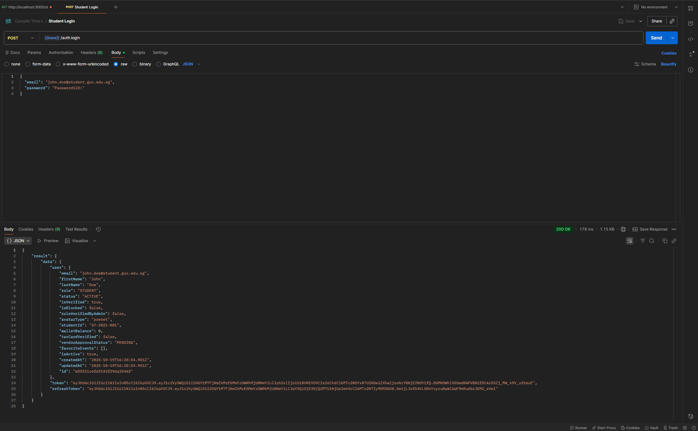
**Test**: Student User Login
- **Route**: `POST /auth.login`
- **Validates**: Student credentials, JWT token generation, user data return
- **Expected**: 200 OK with `accessToken`, `refreshToken`, and user object

### Test Collection 2: Create Comment
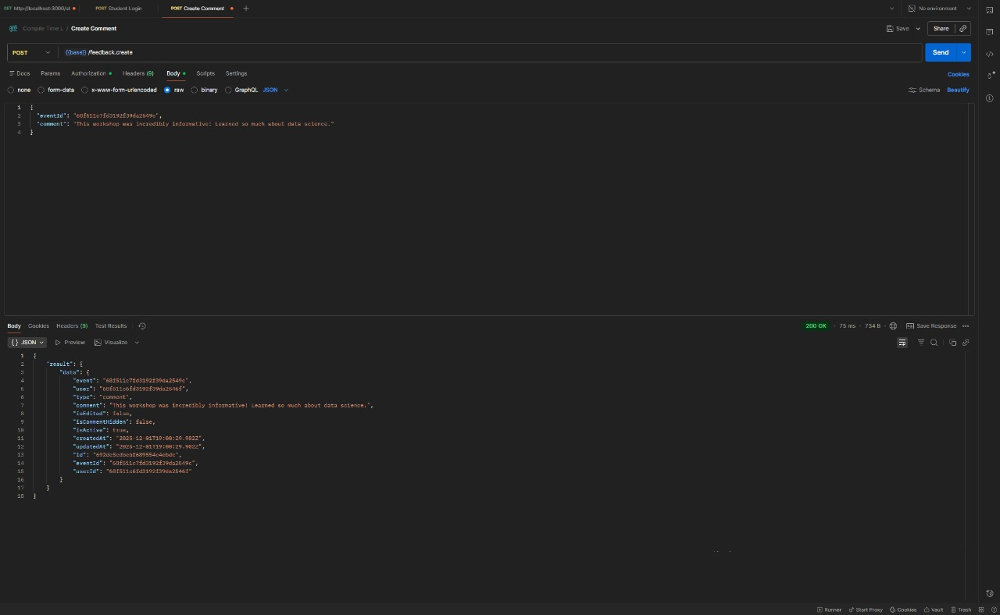
**Test**: Create Comment on Event
- **Route**: `POST /feedback.createComment`
- **Validates**: User authentication, event existence, comment content
- **Expected**: 200 OK with comment object
- **Error Cases**: 401 Unauthorized (not logged in), 404 Event not found

### Test Collection 3: Rating and Comment System
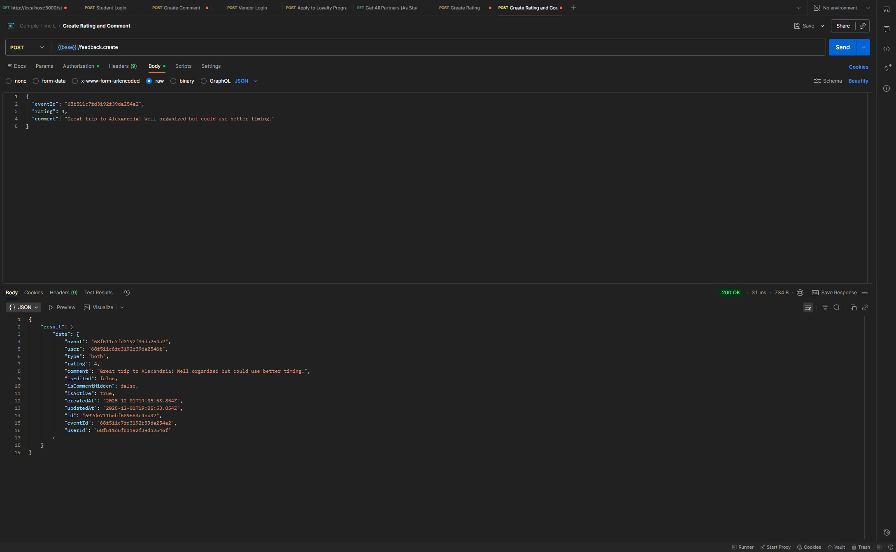
**Test**: Rate Event with Comment
- **Route**: `POST /feedback.rateEvent`
- **Validates**: User attended event, rating range (1-5), comment content
- **Expected**: 200 OK with rating and comment object
- **Special Cases**: 
  - User must have attended the event
  - Cannot rate same event twice

### Test Collection 4: Get Rating Statistics
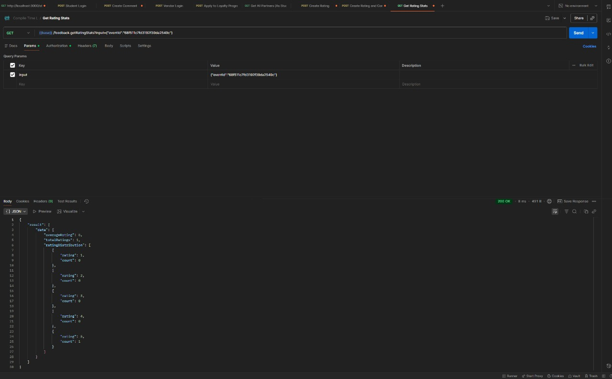
**Test**: Get Event Rating Statistics
- **Route**: `GET /feedback.getRatingStats`
- **Validates**: Event ID, aggregation of ratings
- **Expected**: 200 OK with statistics object including average rating, total count, and distribution

### Test Collection 5: Apply to Loyalty Program
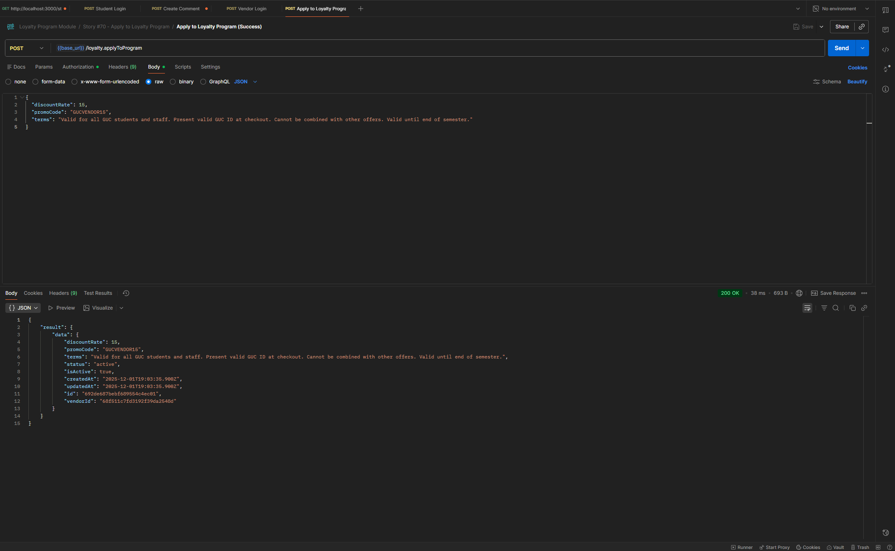
**Test**: Apply to Loyalty Partner Program
- **Route**: `POST /loyalty.applyToPartner`
- **Validates**: User authentication, eligibility check, partner program existence
- **Expected**: 200 OK with application confirmation
- **Special Cases**: 
  - User must have minimum loyalty points
  - Cannot apply to same partner twice

### Postman Collections
- [Feedback Module Collection](./backend/collections/Compile%20Time%20L%20Feedback%20Module.postman_collection.json)
- [Loyalty Program Module Collection](./backend/collections/Loyalty%20Program%20Module.postman_collection.json)

### Running Postman Tests
1. Open Postman
2. Import collections from `backend/collections/`
3. Set environment variables:
   ```
   base: http://localhost:5000
   accessToken: <your_jwt_token>
   ```
4. Run collection with "Collection Runner"

---

## 🤝 How to Contribute

We welcome contributions from developers, designers, and testers! Here's how you can help:

### Reporting Issues
1. Check existing issues on GitHub
2. Create a new issue with:
   - Clear title and description
   - Steps to reproduce (for bugs)
   - Expected vs actual behavior
   - Screenshots (if applicable)
   - Environment details (OS, Node version, browser)

### Contributing Code
1. **Fork the repository**
2. **Create a feature branch**
   ```bash
   git checkout -b feature/your-feature-name
   ```
3. **Follow code style guidelines** (see Code Style section)
4. **Write tests** for new features
5. **Commit with clear messages**
   ```bash
   git commit -m "feat: add loyalty badge system"
   ```
6. **Push to your fork**
   ```bash
   git push origin feature/your-feature-name
   ```
7. **Open a Pull Request** with:
   - Description of changes
   - Related issue number
   - Screenshots (if UI changes)
   - Test results

### Areas for Contribution
- **Frontend**: 
  - Improve mobile responsiveness
  - Add accessibility features (ARIA labels, keyboard navigation)
  - Implement dark mode improvements
  - Create reusable component library

- **Backend**:
  - Increase test coverage (Jest unit tests)
  - Optimize database queries
  - Add API documentation (OpenAPI/Swagger)
  - Implement caching layer (Redis)

- **Features**:
  - Multi-language support (i18n)
  - Real-time chat for events
  - Social media integration
  - Advanced analytics dashboard

- **Documentation**:
  - Improve API documentation
  - Create video tutorials
  - Write contribution guidelines
  - Document deployment process

- **Testing**:
  - Write more Postman test cases
  - Add E2E tests with Playwright
  - Performance testing

### Development Workflow
1. Sync your fork with main repository
2. Create feature branch from `main`
3. Make changes and test locally
4. Run linter: `npm run lint`
5. Run tests: `npm test`
6. Commit and push
7. Open PR for review

### Code Review Process
- All PRs require at least one approval
- Automated checks must pass (linting, tests)
- Address review comments
- Maintain backward compatibility

---

## 🙏 Credits

### Team Members
- **Advanced Computer Lab 2025** - Development Team

### Open Source Libraries & Frameworks
- [React](https://react.dev/) - UI library by Meta
- [Node.js](https://nodejs.org/) - JavaScript runtime
- [Express](https://expressjs.com/) - Web framework
- [MongoDB](https://www.mongodb.com/) - NoSQL database
- [tRPC](https://trpc.io/) - End-to-end type-safe APIs
- [Stripe](https://stripe.com/) - Payment processing
- [shadcn/ui](https://ui.shadcn.com/) - Component library
- [TailwindCSS](https://tailwindcss.com/) - CSS framework
- [Radix UI](https://www.radix-ui.com/) - Accessible components
- [Zustand](https://zustand-demo.pmnd.rs/) - State management
- [TanStack Query](https://tanstack.com/query) - Data fetching
- [Framer Motion](https://www.framer.com/motion/) - Animation library
- [Zod](https://zod.dev/) - Schema validation
- [Mongoose](https://mongoosejs.com/) - MongoDB ODM
- [Nodemailer](https://nodemailer.com/) - Email sending
- [PDFKit](https://pdfkit.org/) - PDF generation
- [QRCode](https://github.com/soldair/node-qrcode) - QR code generation
- [Recharts](https://recharts.org/) - Charting library
- [date-fns](https://date-fns.org/) - Date utilities
- [Lucide Icons](https://lucide.dev/) - Icon library

### Learning Resources & References
- [The MERN Stack Tutorial](https://www.mongodb.com/languages/mern-stack-tutorial) - MongoDB
- [tRPC Documentation](https://trpc.io/docs) - Type-safe API development
- [TypeScript Handbook](https://www.typescriptlang.org/docs/handbook/) - TypeScript learning
- [React 19 Documentation](https://react.dev/blog/2024/04/25/react-19) - React 19 features
- [Clean Architecture in Node.js](https://www.youtube.com/watch?v=CnailTcJV_U) - YouTube tutorial
- [Stripe Integration Guide](https://stripe.com/docs/payments/quickstart) - Stripe documentation
- [MongoDB University](https://university.mongodb.com/) - Database design patterns
- [Postman Learning Center](https://learning.postman.com/) - API testing
- [shadcn/ui Examples](https://ui.shadcn.com/examples) - UI component examples
- [Tailwind UI Components](https://tailwindui.com/) - Design inspiration
- [Web Dev Simplified - MERN Stack](https://www.youtube.com/c/WebDevSimplified) - YouTube channel
- [Fireship - tRPC in 100 Seconds](https://www.youtube.com/watch?v=UfUbBWIFdJs) - Quick tRPC intro
- [Net Ninja - TypeScript Tutorial](https://www.youtube.com/playlist?list=PL4cUxeGkcC9gUgr39Q_yD6v-bSyMwKPUI) - TypeScript basics

### Design & UI Inspiration
- [Dribbble](https://dribbble.com/) - UI/UX inspiration
- [Behance](https://www.behance.net/) - Design projects
- [Awwwards](https://www.awwwards.com/) - Web design inspiration

### Tools & Services
- [Visual Studio Code](https://code.visualstudio.com/) - Code editor
- [Postman](https://www.postman.com/) - API testing
- [MongoDB Compass](https://www.mongodb.com/products/compass) - Database GUI
- [GitHub](https://github.com/) - Version control
- [Stripe Dashboard](https://dashboard.stripe.com/) - Payment management
- [Mailgun](https://www.mailgun.com/) - Email service

### Special Thanks
- German University in Cairo (GUC) for project requirements
- Advanced Computer Lab course instructors
- Open source community for tools and libraries

---

## 📜 License

This project is licensed under multiple licenses due to the use of various third-party services and libraries:

### MIT License
Copyright (c) 2025 Advanced Computer Lab - Another Compile L

Permission is hereby granted, free of charge, to any person obtaining a copy
of this software and associated documentation files (the "Software"), to deal
in the Software without restriction, including without limitation the rights
to use, copy, modify, merge, publish, distribute, sublicense, and/or sell
copies of the Software, and to permit persons to whom the Software is
furnished to do so, subject to the following conditions:

The above copyright notice and this permission notice shall be included in all
copies or substantial portions of the Software.

THE SOFTWARE IS PROVIDED "AS IS", WITHOUT WARRANTY OF ANY KIND, EXPRESS OR
IMPLIED, INCLUDING BUT NOT LIMITED TO THE WARRANTIES OF MERCHANTABILITY,
FITNESS FOR A PARTICULAR PURPOSE AND NONINFRINGEMENT. IN NO EVENT SHALL THE
AUTHORS OR COPYRIGHT HOLDERS BE LIABLE FOR ANY CLAIM, DAMAGES OR OTHER
LIABILITY, WHETHER IN AN ACTION OF CONTRACT, TORT OR OTHERWISE, ARISING FROM,
OUT OF OR IN CONNECTION WITH THE SOFTWARE OR THE USE OR OTHER DEALINGS IN THE
SOFTWARE.

### Third-Party Licenses

#### Apache License 2.0
The following components are licensed under Apache License 2.0:
- **Stripe SDK** (`stripe`) - Payment processing library
  - [Stripe License](https://github.com/stripe/stripe-node/blob/master/LICENSE)
- **MongoDB Driver** (`mongodb`) - Database driver
  - [MongoDB License](https://github.com/mongodb/node-mongodb-native/blob/main/LICENSE.md)

#### BSD Licenses
- **React** - BSD-3-Clause License
- **Express** - MIT License
- **Zod** - MIT License

#### Creative Commons
- **Lucide Icons** - ISC License (permissive)
- **Tabler Icons** - MIT License

### Compliance Notes

1. **Stripe Usage**:
   - Must comply with [Stripe Terms of Service](https://stripe.com/legal)
   - PCI DSS compliance required for payment data
   - Must display Stripe branding as per brand guidelines

2. **MongoDB Usage**:
   - Server Side Public License (SSPL) for MongoDB Community Server
   - If hosting as a service, must open-source the management layer

3. **Email Services**:
   - Mailgun: Commercial license, check [Mailgun Terms](https://www.mailgun.com/legal/terms/)
   - Nodemailer: MIT License

4. **Open Source Components**:
   - All listed dependencies maintain their original licenses
   - See `package.json` files for complete dependency list
   - Licenses available in `node_modules/<package>/LICENSE`

### Trademark Notices
- **Stripe** is a registered trademark of Stripe, Inc.
- **MongoDB** is a registered trademark of MongoDB, Inc.
- **React** is a registered trademark of Meta Platforms, Inc.
- **Node.js** is a trademark of Joyent, Inc.

### Attribution Requirements
When using this software, please provide attribution:
```
Event Management System - GUC
Developed by Advanced Computer Lab 2025
Built with React, Node.js, MongoDB, and Stripe
```

### Disclaimer
This project is for educational purposes as part of the Advanced Computer Lab course at GUC. It is not intended for commercial use without proper licensing and compliance checks.

For questions about licensing, contact: [youssef.elkhodary@student.guc.edu.eg]

---

**Built with ❤️ for GUC - Advanced Computer Lab 2025**
